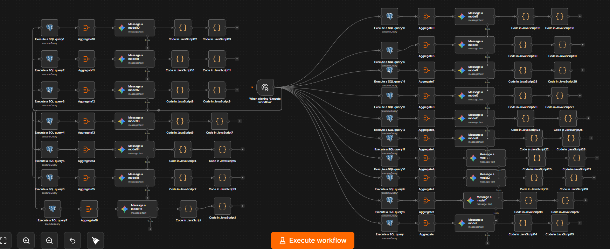

# 🎵 Spotify Product Analytics Agent

> An automated product analytics workflow built with **n8n, PostgreSQL, and Gemini** to transform Spotify catalog data into product insights, feature opportunities, recommendation hypotheses, and roadmap ideas.

---

## 📌 Project Overview

This project demonstrates how a Product Manager can use an automated analytics workflow to move from:

**Raw Spotify Dataset → SQL Analysis → AI-Assisted Interpretation → Product Insights → Feature Opportunities → Roadmap**

Instead of manually analyzing thousands of Spotify tracks, the workflow uses **n8n** as the orchestration layer.

The workflow connects a PostgreSQL database containing Spotify track data to multiple analytical SQL branches. The SQL results are then passed through aggregation and AI analysis steps before being converted into structured product reports.

The goal is not to replace product judgment.

The goal is to **automate repetitive analysis so that more time can be spent on product decisions.**

---

# 🧠 What Problem Does This Solve?

A music product team may have a large catalog containing information such as:

- Track popularity
- Danceability
- Energy
- Valence
- Acousticness
- Tempo
- Instrumentalness
- Speechiness
- Track duration
- Artist
- Genre

The challenge is turning these raw attributes into actionable product questions.

For example:

- Which tracks could support a discovery feature?
- What content could power a mood-based playlist?
- Which tracks look like "hidden gems"?
- Which genres are similar?
- Which artists could be candidates for discovery?
- What tracks have high synthetic skip-risk?
- What content could support a time-based playlist?
- What product experiments could be created from the catalog?
- Which product opportunities should be prioritized?

This project automates that analytical process.

---

# 🏗️ Workflow Architecture

The complete workflow is built in **n8n**.

The architecture contains multiple parallel analytical branches.

Each branch generally follows this pattern:

```text
PostgreSQL
     ↓
SQL Analysis
     ↓
Aggregate
     ↓
Gemini Analysis
     ↓
JavaScript Processing
     ↓
Product Report
```

---

# 🔧 Complete n8n Workflow

The entire analytics pipeline is implemented as a single n8n workflow.

The workflow begins with the trigger on the left and branches into multiple PostgreSQL/SQL analyses. Each analytical branch then passes through aggregation, Gemini analysis, and JavaScript processing before producing its corresponding output.



### What the workflow shows

- One central workflow trigger
- Multiple parallel PostgreSQL analysis branches
- 17 SQL analysis stages
- Aggregation after the SQL analysis
- Gemini/LLM interpretation
- JavaScript processing
- Multiple independent analytical outputs
- A complete end-to-end product analytics pipeline

The workflow is intentionally organized into independent branches so that each analytical question can be processed separately while still being part of the same automated system.

---

# ⚙️ How n8n Is Used

n8n is the **orchestration layer** of the project.

It connects the different components of the analytical pipeline.

The important distinction is:

> **PostgreSQL and SQL perform the core data analysis. n8n orchestrates the analysis. Gemini interprets the analytical results. JavaScript processes the final outputs.**

The workflow therefore follows:

```text
Spotify Dataset
       ↓
PostgreSQL
       ↓
17 SQL Analyses
       ↓
Aggregation
       ↓
Gemini / AI Analysis
       ↓
JavaScript Processing
       ↓
Final Product Outputs
```

### Why n8n?

Using n8n makes it possible to:

- Connect PostgreSQL and AI models in one workflow
- Run multiple analytical branches
- Automate repetitive analysis
- Pass outputs between analytical stages
- Keep the complete process visually understandable
- Reuse the workflow for future datasets
- Capture complete workflow executions

---

# 🧮 The 17 SQL Analyses

A major part of the project is the use of **17 separate SQL analysis branches**.

Each SQL query is designed to answer a different analytical or product question.

The workflow uses these analytical branches instead of relying on a single large query.

## 1. Track Similarity Analysis

Analyzes track-level audio characteristics to identify similar tracks.

The analysis considers attributes such as:

- Danceability
- Energy
- Valence
- Acousticness

### Product Question

> Which tracks could be recommended alongside another track?

### Potential Product Use

- Similar tracks
- "More like this"
- Recommendation systems
- Music discovery

---

## 2. Genre Similarity Analysis

Analyzes audio characteristics at the genre level.

Genres can be compared using characteristics such as:

- Danceability
- Energy
- Valence
- Acousticness

### Product Question

> Which genres have similar musical characteristics?

### Potential Product Use

- Cross-genre discovery
- Genre recommendations
- Discovery playlists

---

## 3. Hidden Gems Analysis

Identifies relatively low-popularity tracks that satisfy stronger audio-feature conditions.

The concept is:

```text
Low Popularity
      +
Strong Audio Characteristics
      ↓
Potential Hidden Gem
```

### Product Question

> Which lesser-known tracks could be surfaced to users?

### Potential Product Use

**Hidden Gems** discovery feature.

---

## 4. Mood-Based Playlist Analysis

Analyzes audio characteristics to identify tracks suitable for different moods.

Examples include:

- Happy & Energetic
- Chill & Relaxing
- Workout Motivation

The analysis uses combinations of audio characteristics such as:

- Valence
- Energy
- Danceability
- Acousticness
- Tempo

### Product Question

> Can audio characteristics be used to create mood-oriented listening experiences?

### Potential Product Use

**Mood-Based Radio / Mood Playlists**

---

## 5. Time-Based Playlist Analysis

Analyzes tracks for different listening contexts and time periods.

Examples include:

- Morning Energizer
- Focus Flow
- Evening Wind Down

### Product Question

> Can track characteristics be mapped to different listening contexts?

### Potential Product Use

**Time-of-Day Playlists**

---

## 6. Viral Discovery Analysis

Creates an analytical `viral_potential_score` using selected track characteristics.

Tracks can be classified into analytical categories such as:

- TikTok Ready
- Feel-Good Viral
- Hype Track
- Organic Growth

### Product Question

> Which tracks could be interesting candidates for discovery or emerging-content experiments?

> **Note:** This is a SQL-defined heuristic and does not predict actual viral performance.

---

## 7. Engagement / Retention Analysis

Creates an analytical engagement score using selected track characteristics.

The analysis considers factors such as:

- Danceability
- Energy
- Valence
- Duration

### Product Question

> Which types of content could potentially support stronger listening engagement?

> **Note:** This is a synthetic analytical score and does not represent measured user retention.

---

## 8. Skip-Risk Analysis

Creates a synthetic skip-risk analysis using multiple track characteristics.

Factors include:

- Track duration
- Energy
- Tempo
- Danceability
- Valence
- Acousticness
- Speechiness
- Instrumentalness

The analysis categorizes potential reasons for higher skip risk.

Examples include:

- Too Long
- Too Slow
- Too Much Talking
- Too Instrumental
- Low Danceability
- Very Low Mood
- Good Retention

### Product Question

> Which track characteristics could potentially contribute to skip behavior?

> **Note:** The skip probability is a SQL-defined heuristic, not an observed user skip rate.

---

## 9. Artist Analysis

Groups the catalog by artist and analyzes artist-level characteristics.

The analysis considers metrics such as:

- Track count
- Average popularity
- Maximum popularity
- Genre diversity

### Product Question

> Which artists could be relevant for discovery experiences?

### Potential Product Use

- Artist Discovery
- Emerging Artist feeds
- Artist recommendations

---

## 10. Cross-Genre Discovery Analysis

Analyzes relationships between individual tracks and genre-level characteristics.

The purpose is to identify potential bridges between different genres.

### Product Question

> If a user likes one type of music, what other genre might they discover?

### Potential Product Use

```text
User likes Genre A
       ↓
Related characteristics
       ↓
Genre B
       ↓
Discovery recommendation
```

---

## 11. Niche Genre Analysis

Analyzes genres based on catalog size, artist representation, and popularity.

### Product Question

> Which genres could represent opportunities for specialized discovery experiences?

### Potential Product Use

- Genre landing pages
- Curated playlists
- Niche discovery
- Genre-specific experiences

---

## 12. Explicit vs. Clean Content Analysis

Compares explicit and clean tracks within genres.

Potential metrics include:

- Track count
- Popularity
- Energy
- Danceability

### Product Question

> Could content preferences differ by genre or listening context?

### Potential Product Experiment

```text
Explicit by default
        vs.
Clean by default
        vs.
Personalized preference
```

This could eventually be validated through an A/B test.

---

## 13. Track Duration Analysis

Analyzes track duration and creates analytical duration categories.

For example:

- Short
- Medium
- Long
- Very Long

### Product Question

> How does track duration affect playlist composition?

### Potential Product Use

- Playlist generation
- Listening-session design
- Playlist duration optimization

---

## 14. Listening Segment Analysis

Creates analytical segments based on track characteristics.

Examples include:

- High Energy
- Mood Boosters
- Chill Seekers
- Discovery Enthusiasts

### Product Question

> What types of listening experiences could be created from the catalog?

> **Note:** These are analytical segments based on catalog characteristics, not identified real users.

---

## 15. Audio Feature Opportunity Analysis

Analyzes audio characteristics to identify content categories.

Examples include:

- Made for Dancing
- High Energy
- Unplugged
- Instrumental
- Low Lyrics / No Lyrics

### Product Question

> Can audio characteristics be turned into useful discovery filters or experiences?

### Potential Product Use

- Discovery filters
- Track badges
- Playlist categories
- Search experiences

---

## 16. Catalog Health Analysis

Produces high-level metrics describing the analyzed music catalog.

Examples include:

- Total active library
- Playlist-ready tracks
- Discovery pool
- Average quality score
- High-quality content

These metrics provide a high-level view of the catalog before product opportunities are prioritized.

### Product Question

> What does the overall catalog look like from a product opportunity perspective?

---

## 17. Product Opportunity & Roadmap Analysis

The final analytical branch converts catalog-level findings into potential product opportunities.

The workflow evaluates opportunities using dimensions such as:

- Addressable content
- Technical feasibility
- User-demand hypothesis
- Priority score
- Roadmap placement

### Product Question

> Which product opportunities should be considered first?

---

# 📊 Product Opportunities Identified

The analysis produces several potential product opportunities.

| Product Opportunity | Addressable Content | Feasibility | Demand | Priority | Roadmap |
|---|---:|---|---|---:|---|
| **Mood-Based Radio** | 114,000 tracks | High | High | 1 | Q1 2025 |
| **Hidden Gems Section** | 26,473 tracks | High | High | 1 | Q1 2025 |
| **Artist Discovery Feed** | 31,437 artists | Medium | High | 2 | Q2 2025 |
| **Time-of-Day Playlists** | 114,000 tracks | High | Medium | 3 | Q3 2025 |

> The priority, feasibility, and demand classifications above are generated by the project's SQL logic. They should be treated as product hypotheses rather than validated market conclusions.

---

# 🤖 AI / Gemini Analysis

After SQL analysis, the workflow passes structured results to **Google Gemini**.

The AI layer is responsible for interpreting the analytical output rather than replacing the underlying SQL calculations.

The architecture is:

```text
SQL
 ↓
Structured Data
 ↓
Aggregate
 ↓
Gemini
 ↓
Product Interpretation
 ↓
JavaScript
 ↓
Final Report
```

The AI layer can transform structured analytical results into:

- Executive summaries
- Key observations
- Product insights
- Feature opportunities
- Recommendations
- Roadmap explanations
- Limitations and caveats

### Important Design Principle

```text
SQL calculates
     ↓
n8n orchestrates
     ↓
Gemini interprets
     ↓
JavaScript formats
     ↓
Product team decides
```

This separation is important because the AI model should not invent the underlying metrics.

---

# 🧑‍💼 Product Management Perspective

This project is designed from a **Product Analytics + Product Management perspective**.

The objective is not simply to answer:

> "What does the dataset contain?"

The objective is to move from:

```text
Data
 ↓
Pattern
 ↓
Insight
 ↓
Product Opportunity
 ↓
Hypothesis
 ↓
Prioritization
 ↓
Experiment
```

For example:

### Observation

The SQL analysis identifies a large set of tracks that satisfy the project's Hidden Gems criteria.

### Product Insight

There may be an opportunity to help users discover high-quality, less-popular music.

### Product Opportunity

Build a **Hidden Gems** discovery experience.

### Next Step

Test the experience using real user behavior.

Potential metrics could include:

- Discovery clicks
- Play starts
- Completion rate
- Saves
- Repeat plays
- Playlist additions
- Session continuation

---

# 📈 Example Catalog Insights

The workflow produces structured analytical outputs that can be used for product decision-making.

Example catalog-level metrics include:

| Metric | Value |
|---|---:|
| Total Active Library | 114,000 |
| Playlist-Ready Tracks | 52,063 |
| Discovery Pool | 65,413 |
| Average Track Quality Score | 0.561 |
| High Quality Content | 13,570 |

These numbers are generated from the dataset and the project's SQL logic.

They should be interpreted as **catalog analytics**, not actual user-behavior metrics.

---

# 🔄 End-to-End Data Flow

The complete project can be summarized as:

```text
                   Spotify Dataset
                         ↓
                    PostgreSQL
                         ↓
                 ┌───────────────┐
                 │   n8n Trigger │
                 └───────┬───────┘
                         ↓
                  17 SQL Analyses
                         ↓
                    Aggregation
                         ↓
                   Gemini / AI
                         ↓
                 JavaScript Nodes
                         ↓
                  Analytical Output
                         ↓
                  Product Insights
                         ↓
               Feature Opportunities
                         ↓
                    Prioritization
                         ↓
                    Roadmap Ideas
```

---

# 📁 Repository Structure

```text
ai-product-analytics-agent/
│
├── README.md
│
├── workflows/
│   └── ai-product-analytics-agent.json
│
├── docs/
│   └── n8n-workflow-full.png
│
├── spotify.csv
│
└── spotify-sample-input.json
```

### `workflows/`

Contains the exported n8n workflow.

### `docs/`

Contains documentation assets such as the full n8n workflow screenshot.

### `spotify.csv`

The Spotify dataset used for the analysis.

### `spotify-sample-input.json`

Sample structured input used for demonstrating the workflow.

---

# 📸 Documentation

## Complete Workflow

The repository includes a screenshot of the complete n8n workflow.


The screenshot provides a visual overview of:

- Workflow trigger
- PostgreSQL nodes
- 17 SQL analytical branches
- Aggregation nodes
- Gemini nodes
- JavaScript nodes
- Final processing stages

---

# ✅ Successful Execution

A historical execution of the workflow was successfully completed.

```text
Execution ID: 414
Status: SUCCESS
Mode: Manual
Started: 2026-08-02 09:39:54
Stopped: 2026-08-02 09:44:24
```

The execution demonstrates the complete workflow running successfully through its analytical branches.

The execution output can be retained as a project artifact for reproducibility and demonstration.

---

# 🛠️ Technology Stack

| Technology | Role |
|---|---|
| **n8n** | Workflow automation and orchestration |
| **PostgreSQL** | Dataset storage and analytical queries |
| **SQL** | Core analytical calculations |
| **Google Gemini** | AI-assisted interpretation |
| **JavaScript** | Data transformation and report processing |
| **GitHub** | Version control and project documentation |
| **CSV** | Dataset storage/import format |
| **JSON** | Workflow and structured data representation |

---

# 🚀 How to Run

## 1. Prepare the Dataset

Load the Spotify CSV dataset into PostgreSQL.

The workflow uses the Spotify table as the analytical source.

---

## 2. Configure PostgreSQL

Create a PostgreSQL credential in n8n and connect it to the SQL nodes.

---

## 3. Configure Gemini

Configure the Google Gemini credential required by the AI analysis nodes.

---

## 4. Import the Workflow

Import:

```text
workflows/ai-product-analytics-agent.json
```

into n8n.

---

## 5. Execute

Start the workflow using:

```text
When clicking 'Execute workflow'
```

The workflow then runs the analytical branches and generates the downstream outputs.

---

# ⚠️ Limitations

This project is a **product analytics prototype**, not a production recommendation system.

The following limitations apply:

- The analysis uses a Spotify catalog dataset rather than live user behavior.
- Skip-risk is a SQL-defined heuristic rather than an observed skip rate.
- Engagement scores are analytical heuristics rather than measured retention.
- Viral-potential scores do not predict actual virality.
- User segments are based on catalog characteristics rather than real user-level behavior.
- Technical feasibility classifications are generated by workflow logic.
- User-demand labels are hypotheses rather than validated user research.
- Roadmap priorities are analytical outputs rather than final product decisions.
- AI-generated interpretations require human review.

---

# 🧪 How This Could Be Validated

The next step would be connecting the analytical hypotheses to real product experiments.

```text
Analytical Hypothesis
        ↓
Product Experiment
        ↓
Real Users
        ↓
Behavioral Data
        ↓
A/B Test
        ↓
Measure Impact
        ↓
Product Decision
```

Potential metrics include:

- Skip rate
- Completion rate
- Save rate
- Repeat listening
- Playlist additions
- Discovery clicks
- Session duration
- Recommendation acceptance
- Retention

This would move the project from **catalog analytics** toward **behavioral product analytics**.

---

# 🔮 Future Improvements

Potential future improvements include:

- Add real user behavioral data
- Add A/B testing
- Add recommendation evaluation metrics
- Add user-level personalization
- Add product KPI dashboards
- Add automated experiment analysis
- Add recommendation feedback loops
- Add scheduled workflow execution
- Add automated GitHub documentation
- Add production monitoring
- Add error handling and retry logic
- Add model evaluation

---

# 🎯 Key Takeaway

This project demonstrates how a Product Manager can combine:

**Data + SQL + Automation + AI + Product Thinking**

to move from a large dataset to actionable product hypotheses.

The core loop is:

```text
Spotify Dataset
      ↓
PostgreSQL
      ↓
17 SQL Analyses
      ↓
n8n Aggregation
      ↓
Gemini Interpretation
      ↓
JavaScript Processing
      ↓
Product Insights
      ↓
Feature Opportunities
      ↓
Prioritization
      ↓
Experiment Ideas
```

The central principle is:

> **Data provides the evidence. AI helps interpret it. Product thinking determines what to do next.**

---

# 👤 Project Focus

**Product Analytics × AI × Automation × Music Discovery**

Built as a portfolio project to demonstrate the intersection of **Product Management, data-driven decision making, workflow automation, SQL analytics, and AI-assisted product analysis**.
